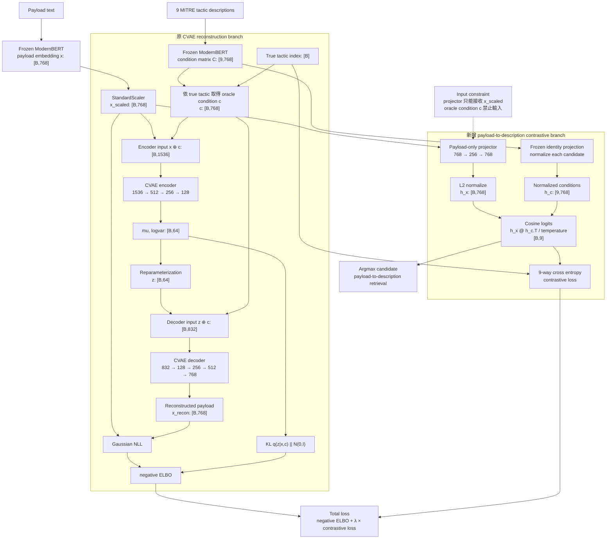
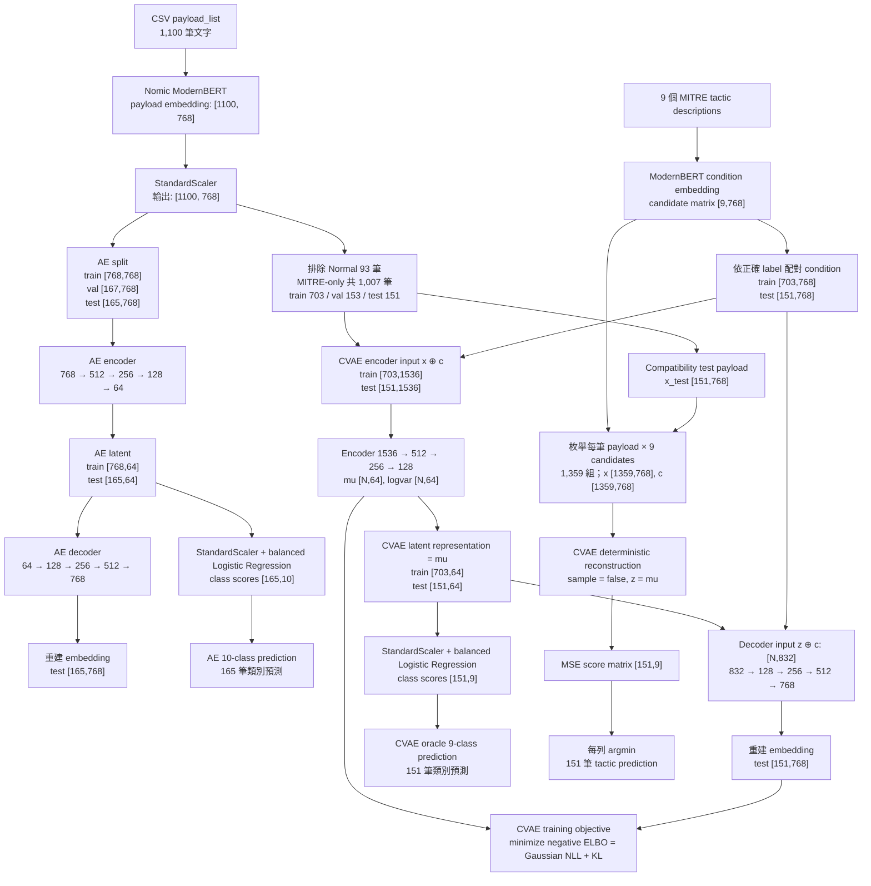

# AE / CVAE / Contrastive CVAE Tactic Experiments

這個實驗框架比較 payload embedding 的 AE latent baseline 與由 MITRE ATT&CK tactic description 約束的 CVAE latent space。模型只使用 frozen text embeddings，不會 fine-tune payload/condition embedding model 或大型語言模型，也不需要線上 API。

## 新增實驗：Payload-to-description Contrastive CVAE

Contrastive CVAE 是獨立、opt-in 的實驗分支。它共用既有的資料讀取、deterministic split、preprocessing、condition embedding 與評估工具，但使用獨立的 model、trainer、CLI、config、checkpoint 和輸出根目錄。執行這個分支不會訓練或覆寫原本的 `ae.pt`、`cvae.pt`，既有 `run_experiment.py` 與 `configs/default.yaml` 的行為維持不變。

新模型保留原本的 CVAE 路徑，另外加入只能讀取 payload `x` 的 semantic alignment branch：

```text
CVAE branch:
    q(z | x, c) → z
    p(x | z, c) → x_recon

Contrastive branch:
    h_x    = normalize(payload_projector(x))
    h_c[j] = normalize(candidate_condition[j])
    logits = h_x @ h_c.T / temperature

negative_ELBO = Gaussian_NLL(x, x_recon) + KL(q(z | x, c) || N(0, I))
contrastive    = cross_entropy(logits, true_tactic_index)
total_loss     = negative_ELBO + contrastive_weight × contrastive
```



設計約束：

- Contrastive payload branch 只接收 `x`，不能讀取正確 condition `c`，避免直接複製 oracle condition 的 leakage。
- 每筆 payload 都與完整的 9 個唯一 tactic descriptions 比較，不以 batch 對角線建立負例，因此同 tactic payload 不會互相成為 false negative。
- Condition branch 預設為 frozen identity projection，保留 pretrained text embedding 的 cosine geometry；只訓練 payload projector 對齊該空間。
- 預設 `temperature: 0.1`、`contrastive_weight: 100.0`。兩個分量及 weighted contrastive loss 都會分別記錄，方便後續調整尺度。

執行正式實驗：

```powershell
uv run python experiments\ae_cvae_tactic\run_contrastive_experiment.py `
  --config experiments\ae_cvae_tactic\configs\contrastive.yaml
```

結果會寫入獨立路徑 `outputs/ae_cvae_tactic_contrastive/<timestamp>/`，主要產物包括：

- `checkpoints/contrastive_cvae.pt`
- `logs/contrastive_cvae_history.csv`
- `metrics/contrastive_cvae_metrics.json`
- `metrics/contrastive_score_matrix.npz`
- `metrics/contrastive_retrieval_results.csv`
- `latent/contrastive_payload_*_latent.npz`
- `latent/contrastive_cvae_*_latent.npz`
- `reports/contrastive_report.md`

`contrastive_payload_*` 是沒有讀取 oracle condition 的 payload-only 表徵；`contrastive_cvae_*` 則是有 condition 的 CVAE latent，兩者不可當成相同意義的分類結果。固定 9 個 descriptions 的實驗仍可能學成 closed-set 9-class prototype mapping；若要證明模型利用可泛化的文字語意，後續仍需以未參與訓練的 paraphrase 或 unseen descriptions 評估。

更集中的實作與輸出說明見 [`CONTRASTIVE_EXPERIMENT.md`](CONTRASTIVE_EXPERIMENT.md)。

## 實驗流程與資料維度

以下樣本數沿用 `outputs/ae_cvae_tactic/2026-06-20_003300` 的 deterministic split，維度則對應目前的預設設定：payload 與 condition 都使用 ModernBERT 的 768 維 embedding。Shape 統一表示為 `[樣本數, 特徵維度]`；模型以 batch 執行時，圖中的樣本數會替換為 batch size `B`。

> `2026-06-20_003300` 是改版前以 384 維 MiniLM condition 與 `MSE + 0.01 × KL` 目標函數產生的既有結果。其 CVAE checkpoint 與新版 768 維 condition／ELBO 設定不相容；新版實驗必須建立新的 run directory 並重新訓練 CVAE。



各階段的 input/output 摘要：

| 階段 | 數量 | Input shape | Output shape |
| --- | ---: | --- | --- |
| Payload embedder | 1,100 payload | 1,100 筆文字，每筆最多 8,192 tokens | `[1100, 768]` |
| AE encoder | 1,100；split 為 768/167/165 | `[N, 768]` | latent `[N, 64]` |
| AE decoder | 同 AE encoder | latent `[N, 64]` | reconstruction `[N, 768]` |
| AE 10-class probe | train 768、test 165 | latent `[N, 64]` | class scores `[N, 10]`、label `[N]` |
| AE MITRE-only probe | train 703、test 151 | latent `[N, 64]` | class scores `[N, 9]`、label `[N]` |
| Condition embedder | 9 tactic descriptions | 9 筆 condition 文字 | candidate matrix `[9, 768]` |
| CVAE encoder | 1,007；split 為 703/153/151 | `x [N,768] ⊕ c [N,768] = [N,1536]` | `mu [N,64]`、`logvar [N,64]` |
| CVAE decoder | 同 CVAE encoder | `z [N,64] ⊕ c [N,768] = [N,832]` | reconstruction `[N,768]` |
| CVAE oracle probe | train 703、test 151 | latent `mu [N,64]` | class scores `[N,9]`、label `[N]` |
| Compatibility test | 151 test payload × 9 conditions = 1,359 pairs | `x [1359,768]`、`c [1359,768]` | reconstruction score `[151,9]`、label `[151]` |

AE/CVAE 本體沒有 classification head。表中的 probe 是在 frozen 64 維 latent 上另外訓練的 `StandardScaler + LogisticRegression(class_weight="balanced")`。Compatibility test 也不使用此 probe，而是從每筆 payload 對 9 個 candidate condition 的 reconstruction MSE 中選擇最低者。

### CVAE ELBO 目標函數

CVAE 對標準化後的連續 embedding 採用固定變異數 Gaussian likelihood：

```text
q(z | x, c) = Normal(mu, diag(exp(logvar)))
p(z)        = Normal(0, I)
p(x | z, c) = Normal(x_recon, observation_variance × I)

ELBO = E_q[log p(x | z, c)] - KL(q(z | x, c) || p(z))
loss = negative_ELBO
     = Gaussian_NLL(x, x_recon) + KL(q(z | x, c) || p(z))
```

預設 `observation_variance: 1.0`；Gaussian likelihood 要求 `reconstruction_loss: mse`。標準 ELBO 的 KL 權重固定為 1，不再使用 `beta`。訓練與 early stopping 都最小化 `negative_elbo`。輸出指標意義如下：

- `recon_mse`：重建 embedding 的平均平方誤差，方便與舊實驗及 AE 比較。
- `recon_nll`：Gaussian reconstruction negative log-likelihood。
- `kl_loss`：approximate posterior 與標準常態 prior 的 KL divergence。
- `elbo`：越大越好。
- `negative_elbo`：實際最小化的 loss，越小越好。

Compatibility prediction 仍依設定使用 deterministic reconstruction MSE，而不是 ELBO。這是刻意分離「CVAE 訓練目標」與「候選 tactic 選擇分數」。

## 環境與安裝

Repository 目前使用 Python 3.12 的 `.venv`。在 repository root 執行：

```powershell
uv sync
```

預設 payload 與 condition 都使用 [`nomic-ai/modernbert-embed-base`](https://huggingface.co/nomic-ai/modernbert-embed-base)，並釘選相同 revision `d556a88e...`。模型原生支援 8,192 tokens，兩種文字都輸出 768 維 sentence embedding。第一次使用尚未快取的模型時，Hugging Face 會下載模型檔，但程式不會呼叫付費或線上推論 API。

若沒有 sentence-transformers 且 condition file 也沒有預先計算的 embedding，程式會停止並顯示：

> No text embedding backend available. Please provide precomputed condition embeddings or install sentence-transformers.

UMAP 未安裝時只跳過 UMAP。Parquet 需要 `requirements-optional.txt`；預設 NPZ 不需要 pyarrow。

## 快速執行

預設 config 已指向 `Year=2022/Step2_golden_review_with_Tactic.csv`，input=`payload_list`、target=`Tactic`、sample ID=`Session_ID`：

```powershell
# AE baseline
uv run python experiments\ae_cvae_tactic\run_experiment.py --config experiments\ae_cvae_tactic\configs\default.yaml --run ae

# CVAE oracle-condition latent evaluation
uv run python experiments\ae_cvae_tactic\run_experiment.py --config experiments\ae_cvae_tactic\configs\default.yaml --run cvae

# CVAE training/loading plus compatibility test
uv run python experiments\ae_cvae_tactic\run_experiment.py --config experiments\ae_cvae_tactic\configs\default.yaml --run compatibility

# Six condition ablations
uv run python experiments\ae_cvae_tactic\run_experiment.py --config experiments\ae_cvae_tactic\configs\default.yaml --run ablation

# Everything; the full-condition CVAE is reused instead of trained twice
uv run python experiments\ae_cvae_tactic\run_experiment.py --config experiments\ae_cvae_tactic\configs\default.yaml --run all
```

使用既有 output/checkpoint：

```powershell
uv run python experiments\ae_cvae_tactic\run_experiment.py --config experiments\ae_cvae_tactic\configs\default.yaml --run compatibility --run-dir outputs\ae_cvae_tactic\2026-xx-xx_xxxxxx
```

`--run-dir` 會重新建立相同 deterministic split/preprocessing，並在 checkpoint 存在時載入模型。config、資料與模型維度必須相容。

## Data adapter contract

可從 `configs/template.yaml` 建立新 config。路徑相對於 repository root 解析。

CSV/JSONL 必須設定下列三種 input representation 的其中一種：

- `embedding_col`：每列為 JSON/Python list，例如 `[0.1, 0.2]`。
- `embedding_prefix`：所有以前綴開頭的數值欄，例如 `emb_000`。
- `payload_text_col`：原始文字；預設會把 Python-list 字串安全解析並用 `[PACKET]` 串接。

NPY/NPZ 必須是 `[num_samples, input_dim]` 矩陣。NPZ key 由 `data.array_key` 控制。label、sample ID 與 metadata 可放在 `metadata_path` 指定的 CSV/JSONL sidecar。

要新增格式，實作 `data.adapters.DataAdapter.load(config) -> LoadedData`，再於 `load_raw_data` factory 註冊。不要讓 adapter 執行 split、scaling 或模型訓練。

欄位需求：

- AE 只需要 input；無 label 時仍可訓練，但跳過 supervised metrics。
- CVAE 的 full/short/keywords/wrong 需要 `condition_key_col` 或 `label_col` 對應 condition record。
- 完全無 label/condition key 時只能使用 `condition_mode: none`，此時是 unconditional VAE ablation。
- `input_dim`、`condition_dim` 可留 null 自動推斷；手動值不一致會立即報錯。

Split 支援 `stratified`、`random`、`time`。time 模式需要把 `time_col` 同時列入 `metadata_cols`。StandardScaler/MinMaxScaler 只 fit train；L2/none 是 stateless transformer。split assignment 與 scaler 都會輸出。

目前資料的 Defense Evasion 只有兩筆，固定分到 train/test 各一筆、val 零筆。相同 payload 不做 group split，因此可能跨 split，report 會保留這個 leakage warning。

## Payload embedding

預設使用 Nomic ModernBERT embedding model 的原生 8,192-token context，不再使用 512-token RoBERTa 或 sliding-window 聚合。模型 repository 已包含 sentence-transformers pooling 與 normalization modules，框架會輸出 L2-normalized 768 維 embedding。

Embedding 前會先計算每筆 payload 的 token 長度。`overflow_strategy: error` 是預設值：任何資料超過 8,192 tokens 都會列出 row index 與實際長度並停止，避免靜默截斷。只有明確改成 `overflow_strategy: truncate` 才允許截斷。Embedding cache key 包含完整文字、model revision、max length 與 overflow policy。

目前 `Step2_golden_review_with_Tactic.csv` 使用此 tokenizer 的最大長度為 2,662 tokens（p99 約 691），1,100 筆都在 8,192-token 上限內，因此不需要截斷或分塊。

若資料已有 embedding，設定 `embedding_col`、`embedding_prefix` 或 NPY/NPZ 即可完全略過 payload embedder。

## Condition file

內建 `conditions/mitre_attack_v11_3.yaml` 固定使用 Enterprise ATT&CK 11.3，與 2022-10 資料時點一致。它刻意不包含 `Normal (TA9000)`，因為這不是 MITRE ATT&CK tactic；預設 CVAE 排除 Normal，AE 則同時輸出十類與 MITRE-only 九類結果。

YAML/JSON 可使用以 label 為 key 的 mapping：

```yaml
tactics:
  "Initial Access (TA0001)":
    label: "Initial Access (TA0001)"
    tactic_id: "TA0001"
    description_full: "..."
    description_short: "..."
    keywords: ["exploit", "phishing", "valid accounts"]
    embedding: [0.1, 0.2]
```

CSV 則每列一個 tactic。Loader 優先以 ATT&CK ID 配對，再使用完整 label/name。若設定 `embedding_field`，會直接讀向量；否則透過 `TextEmbedder` 轉換文字。缺少 tactic 時，錯誤訊息會列出所有缺失 label。

Condition modes：

- `full`、`short`、`keywords`：對應三種文字內容。
- `random`：每個 tactic 一個固定、seeded、L2-normalized 隨機向量，保留類別 identity 但移除語意。
- `wrong`：以固定 derangement 配對錯誤 tactic description，mapping 會輸出到 embeddings metadata。
- `none`：固定全零 condition，CVAE 退化為 unconditional VAE。

## Evaluation 與輸出

每次 run 建立獨立 timestamp directory，包含：

- `config_resolved.yaml`、`environment.json`、`split_assignments.csv`
- `checkpoints/`、`scalers/`、`embeddings/`、`latent/`
- `metrics/`：分類、分群、compatibility、ablation CSV/JSON
- `plots/`：PCA、t-SNE、UMAP、confusion matrices、training curves
- `reports/report.md`

Latent NPZ 包含 `sample_id`、`label`、`split`、`latent`，不需 `allow_pickle=True`。分類器只在 frozen latent 上訓練，支援 logistic regression、random forest、MLP。KMeans 只 fit train latent，再 predict test。

Compatibility 對每個 test payload 枚舉全部 candidate tactic conditions，以 `z=mu` 的 deterministic reconstruction error 選最低分 tactic。輸出完整 score matrix、逐樣本預測、candidate 平均分與 true-tactic × candidate 平均表。

## 研究解讀與限制

AE latent 分類是 payload embedding 本身 tactic-level 可分性的 baseline。

> CVAE oracle-condition classification is not a pure payload-only tactic prediction test. It evaluates whether latent representation becomes more tactic-aligned when conditioned on known tactic descriptions.

Oracle CVAE 已經取得正確 tactic description，不能視為純 payload classifier。Compatibility test 才是把同一 payload 與所有 tactic descriptions 比較的推論測試。

如果 full/short/keywords/random/wrong 的結果接近，CVAE 可能只忽略 C 或把 C 當任意類別代碼；錯誤 C 導致 reconstruction/compatibility 明顯惡化，才支持語意 condition 有效。

模型學到的是 embedding model 對 payload 的表示，不是 raw packet。Nomic ModernBERT 是一般長文本 embedding model，未特別針對網路封包或資安語意訓練，因此 latent 仍可能主要反映一般 token/文字相似性；後續應以相同 split 比較不同 payload embedding backend。

## 正式實驗需要提供／確認的資料

目前 repository 的 CSV 已可直接執行，不需再補格式。若更換資料，至少要確認：

- input path 與 CSV/JSONL/NPY/NPZ 格式。
- `sample_id_col`；省略時會使用 row index。
- `label_col`；省略時只執行 unsupervised reconstruction/visualization。
- `payload_text_col`、`embedding_col`、`embedding_prefix` 三者之一，或 NPY/NPZ feature matrix。
- 非 none CVAE 所需的 `condition_key_col`，以及涵蓋所有 condition keys 的 condition file。
- 若 condition file 只有文字，需可用的 sentence-transformers；若包含向量，設定 `embedding_field`。

目前刻意未納入或受限的部分：

- Compatibility predictor 依本次研究決策只使用 deterministic reconstruction error，未以 ELBO 選類別。
- 相同 payload 不做 group-aware split；如要更嚴格估計泛化能力，後續應新增 payload hash/group 欄位並切換 group split。
- 不做 AE/CVAE supervised joint training、不 fine-tune embedding model、不呼叫線上 API。
- 預設是單一 seed run，未自動執行多 seed 信賴區間。
- Parquet 是 optional dependency；預設 latent export 為 NPZ。

## Tests

```powershell
uv run python -m unittest discover -s experiments\ae_cvae_tactic\tests -v
```

測試使用 synthetic precomputed embeddings，不下載模型。
