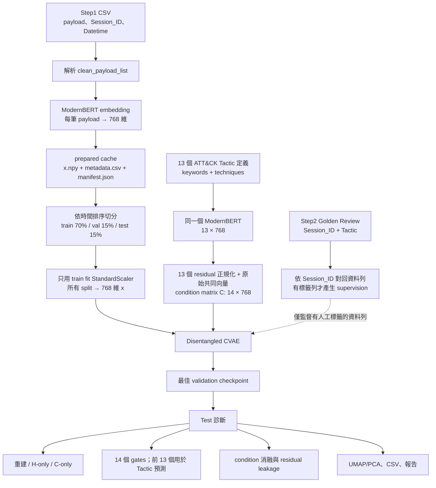
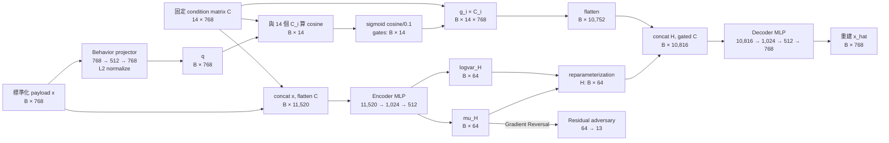

# Step1 Disentangled CVAE：把網路 Payload 拆成「Tactic 語意」與「其他資訊」

這個實驗想回答一個問題：**只看網路 payload 的文字表示，能不能把其中與 MITRE ATT&CK Tactic 有關的訊息，和其他仍然需要保留的訊息分開表示？**

模型不直接處理封包 bytes，而是先把每筆 payload 轉成 768 維 ModernBERT embedding，再嘗試拆成兩條路：

- `C`（condition 路徑）：13 個中心化 ATT&CK Tactic 向量，加上中心化時扣除的共同向量，共 14 個 conditional；模型替每筆 payload 算 14 個 gate。
- `H`（residual 路徑）：64 維潛在向量，負責保留不容易由 Tactic condition 解釋、但重建原始 embedding 仍需要的資訊。

最後 decoder 使用 `H + gated conditions` 重建原始 payload embedding。如果完整重建明顯優於只用 `H`，且 gate 又能對齊人工複核的 Tactic，才有證據支持這個拆分方向。

> [!IMPORTANT]
> `disentangled` 是這個模型想達成的目標，不是架構自動提供的保證。Gate 也不是校準過的攻擊機率。判讀結果時必須同時檢查語意對齊、重建增益、消融實驗與 residual leakage。

## 先用一個比喻理解

可以把每筆 payload 想成一篇內容混雜的短文：

- 13 張「Tactic 語意卡」描述 Initial Access、Execution、Discovery 等行為，另保留一張從所有卡片抽出的「共同內容卡」。
- 模型先判斷這篇短文和 14 張卡各有多像，產生 14 個 gate。
- 被打開的語意卡走 `C` 路徑。
- 語意卡沒有涵蓋、但重建原文特徵仍需要的內容，放進 `H`。
- decoder 拿 `H` 和打開的語意卡，嘗試還原原本的 768 維 payload embedding。

理想情況下，`C` 說明「像哪些攻擊目的」，`H` 保留協定、格式、內容風格等剩餘資訊。但模型可能把所有資訊都偷塞進 `H`，或讓所有 gate 都接近相同數值，所以後面還需要專門的 loss 與診斷指標。

## 整體實驗框架

整個實驗分成三層：資料準備、模型訓練、測試診斷。



### 各階段輸入與輸出

| 階段 | 輸入 | 主要處理 | 輸出 |
| --- | --- | --- | --- |
| Prepare payload | `Step1_rawdata_cleaned.csv` | 解析 payload、ModernBERT 編碼 | `x.npy [N, 768]`、metadata、manifest |
| Split / scale | prepared cache | 時間切分；只用 train fit scaler | 標準化 `x [N, 768]` |
| Prepare conditions | 13 個 Tactic 的 keywords、techniques | ModernBERT、中心化；只正規化 13 個 residual，保留原始共同向量 | `C [14, 768]` |
| Golden supervision | `Session_ID, Tactic` | 對回 prepared metadata | target `[N]`；無標籤為 `-1` |
| Train | batch `x [B, 768]`、固定 `C [14, 768]` | CVAE、gate、重建與 loss | checkpoint、training history |
| Evaluate | test split、最佳 checkpoint | deterministic inference 與消融 | gates、H、語意摘要、metrics、plots |

`N` 是資料總筆數，`B` 是 batch size（預設 128）。

## 模型流程與完整維度

預設設定使用：

- payload 維度 `D_x = 768`
- condition 數量 `K = 14`（13 個 Tactic + 1 個共同 conditional）
- condition 維度 `D_c = 768`
- residual 維度 `D_h = 64`
- 每筆資料展平後的全部 conditions：`K × D_c = 14 × 768 = 10,752`



### 張量速查表

| 名稱 | 預設 shape | 白話意思 |
| --- | ---: | --- |
| `x_raw` | `[B, 768]` | ModernBERT 產生的原始 payload embedding |
| `x` | `[B, 768]` | 用 train 統計量標準化後，真正送入模型的向量 |
| `C` | `[14, 768]` | 13 個中心化 Tactic 向量與 1 個共同 conditional |
| encoder input | `[B, 11,520]` | `x` 加上展平的全部 `C` |
| `h_mu`, `h_logvar` | `[B, 64]` | residual posterior 的平均與 log variance |
| `H` | `[B, 64]` | 抽樣後的 residual；驗證與測試直接使用 `h_mu` |
| behavior query `q` | `[B, 768]` | payload 投影到 condition 語意空間後的單位向量 |
| cosine / gate | `[B, 14]` | 每筆 payload 對 14 個 conditional 的分數 |
| gated conditions | `[B, 14, 768]` | 每個 condition 向量乘上自己的 gate |
| decoder input | `[B, 10,816]` | 64 維 `H` 加 10,752 維 gated conditions |
| `x_hat` | `[B, 768]` | 重建的標準化 payload embedding |
| semantic summary `C_summary` | `[B, 768]` | 依 gate 加權平均後的 condition 表示 |
| combined `HC` | `[B, 832]` | `H [64]` 與 `C_summary [768]` 串接的分析表示 |

### 1. Payload behavior projector

Projector 把標準化後的 payload embedding 投影回 768 維 condition 空間：

```text
q = normalize(MLP(x))
```

它的工作不是重建 payload，而是學會「應該拿 payload 的哪些特徵，去和 ATT&CK condition 比較」。Golden Tactic 的 supervision 主要作用在這條路徑。

### 2. Gate：每個 condition 獨立打分

對第 `i` 個 condition：

```text
s_i = cosine(q, C_i)
g_i = sigmoid(s_i / temperature)
```

預設 `temperature = 0.1`。14 個 gate 使用獨立 sigmoid，不是 softmax，因此同一筆 payload 可以同時有多個 gate 超過門檻。Golden classification 與 adversary 只使用前 13 個 Tactic conditions；第 14 個共同 conditional 只參與 gate、重建與非監督式 loss。

需要注意：

- 預設門檻 `0.5` 等價於 cosine `>= 0`，因為 `sigmoid(0) = 0.5`。
- Gate 代表模型內部的相對語意證據，不是「有 80% 機率發生該攻擊」。
- 程式輸出欄位沿用 `condition_prob__*` 名稱，但目前沒有做 probability calibration。
- Golden supervision 是 single-label cross entropy；多 gate 輸出則是模型推論時的表示方式，不能直接當成經驗證的 multi-label classifier。

### 3. Residual CVAE encoder

Encoder 看到 payload `x` 和完整 condition matrix `C`，輸出 `H` 的 posterior：

```text
mu_H, logvar_H = Encoder(concat(x, flatten(C)))
H = mu_H + epsilon * exp(0.5 * logvar_H)
```

訓練時會抽樣；validation/test 使用 `H = mu_H`，讓輸出可重現。所有 sample 看到的 `C` 都相同，sample-specific 的 condition 選擇發生在 gate，而不是 condition matrix 本身。

### 4. Gated conditions 與 decoder

每個 condition 先乘自己的 gate，再全部展平：

```text
C_gated_i = g_i * C_i
x_hat = Decoder(concat(H, flatten(C_gated)))
```

Decoder 必須同時利用 residual 與 condition 路徑重建 `x`。如果把 gate 全設為 0 後，重建仍然完全不變，表示 decoder 可能忽略 condition 路徑。

### 5. Residual adversary

Residual adversary 嘗試從 `h_mu` 預測 Tactic：

```text
h_mu → Gradient Reversal → Linear(64, 13)
```

分類器本身想把 Tactic 猜對；gradient reversal 會把回到 encoder 的梯度反向，迫使 `H` 少帶一些 Tactic 訊息。目前 baseline 的 `residual_adversary` 權重是 `0.1`，因此這條路徑會參與訓練；`residual_adversary_strength = 1.0` 則控制反轉梯度的倍率。

## 資料如何進入實驗

### Step1 payload 資料

預設輸入是：

```text
Year=2022/Step1_rawdata_cleaned.csv
```

| 設定 | 預設欄位 | 用途 |
| --- | --- | --- |
| sample ID | `Session_ID` | 串接 golden review、追蹤輸出 |
| payload | `clean_payload_list` | 真正送去做文字 embedding 的內容 |
| time | `Datetime` | chronological split |
| Step1 label | `Sess_Tactic_predict` | 保留在 metadata；不當訓練 target |

`clean_payload_list` 如果是 Python list/tuple 字串，會先解析，再用 `\n[PACKET]\n` 串起各段 payload。空的 Step1 label 預設會被濾掉，但留下來的 `Sess_Tactic_predict` **只供追蹤，不參與模型 supervision、condition alignment 或評估 ground truth**。

### Payload embedding 與長文本

預設 embedder：

```text
model: nomic-ai/modernbert-embed-base
revision: d556a88e332558790b210f7bdbe87da2fa94a8d8
output dimension: 768
max length: 8192 tokens
normalize: true
overflow strategy: chunk_mean
```

超過 8192 tokens 的 payload 會切成多個 token chunks，分別編碼後按 chunk token 數加權平均，再重新 L2 normalize，避免靜默截斷。

### Prepared cache

Prepare 完成後會產生：

```text
outputs/disentangled_cvae_step1/prepared/step1_clean_payload_modernbert/
├── x.npy          # [N, 768]，float32，可用 memory map 載入
├── metadata.csv   # sample、time、payload hash、原始追蹤欄位
└── manifest.json  # 來源檔與 embedding 設定 fingerprint、shape、統計
```

來源檔大小、修改時間或相關設定改變時，fingerprint 會失效並重做 cache。也可以用 `--force-prepare` 強制重建。

### 時間切分與避免 preprocessing leakage

資料按 `Datetime` 排序後切成：

```text
較早 ─── train 70% ─── validation 15% ─── test 15% ─── 較晚
```

`StandardScaler` 只在 train rows 上 fit，再 transform train/validation/test。這避免 validation/test 的均值與變異數提前洩漏進訓練。不過相同 payload 仍可能跨 split，因此另輸出 `leakage_report.json` 檢查重複的 payload hash。

## 13 個 ATT&CK conditions 與第 14 個共同 conditional

Condition 定義位於 [`conditions/mitre_attack_v11_3_step1.yaml`](conditions/mitre_attack_v11_3_step1.yaml)。每個 condition 使用 `keywords + top-level technique names` 組成文字，再用和 payload 相同的 ModernBERT 編碼。

| Tactic | 白話說明 |
| --- | --- |
| Initial Access (TA0001) | 想辦法第一次進入目標環境 |
| Execution (TA0002) | 在本機或遠端執行攻擊者控制的程式或命令 |
| Persistence (TA0003) | 重開機、改密碼後仍能維持存取 |
| Privilege Escalation (TA0004) | 把權限提升成 administrator、root 或 system |
| Defense Evasion (TA0005) | 躲避偵測、停用或繞過防禦措施 |
| Credential Access (TA0006) | 取得帳號、密碼、token 等憑證 |
| Discovery (TA0007) | 探索主機、帳號、服務與內部網路環境 |
| Lateral Movement (TA0008) | 從已入侵位置移動到其他內部系統 |
| Collection (TA0009) | 蒐集後續要利用或帶走的資料 |
| Exfiltration (TA0010) | 把資料傳出目標環境 |
| Command and Control (TA0011) | 和受控系統建立通訊並下達控制命令 |
| Resource Development (TA0042) | 準備攻擊需要的帳號、基礎設施或能力 |
| Reconnaissance (TA0043) | 攻擊前蒐集目標資訊、規劃行動 |

`Normal (TA9000)` 刻意不放進 condition matrix。第 14 個 gate 是從 13 個 Tactic embeddings 扣除的共同向量，不是「正常」類別；golden review 中的 Normal 因此仍無法成為 13 類 InfoNCE target。

### Condition geometry 為什麼要轉換

ATT&CK 描述常共享「adversary、system、network」等詞，原始 condition embeddings 可能全部很像。預設做：

1. 對 13 個向量求共同中心。
2. 每個 condition 減去共同中心。
3. 將 13 個中心化向量各自 L2 normalize。
4. 把未正規化、實際被扣除的共同中心直接附加在最後一列，形成 `[14, 768]` condition matrix。模型計算 cosine gate 時會在內部暫時正規化它，但 encoder／decoder 接收的是原始 centroid 幅度。

設定中的 `remove_top_components: 0` 表示目前不額外移除 PCA components。這個轉換只改 condition 幾何，不 fine-tune ModernBERT。Raw 與 transformed cosine matrices 都會輸出，方便確認 conditions 是否仍然擠在一起。

## Golden supervision 到底監督什麼

預設 golden 檔案：

```text
Year=2022/Step2_golden_review_2_with_Tactic.csv
```

程式只讀 `Session_ID` 與人工複核的 `Tactic`，再用 `Session_ID` 對回 prepared metadata：

- 對得到且 Tactic 是 13 個已知 condition：target 為 `0..12`，參與 behavior InfoNCE 與 adversary loss。
- 沒對到、空標籤、Normal 或未知 condition：target 為 `-1`，不參與這兩個 supervised losses。
- 沒有 golden label 的 row 仍會參與 reconstruction、KL 與其他 unsupervised losses。

Behavior InfoNCE 在實作上是 condition prototypes 上的 cross entropy：

```text
logits = cosine(q, C) / behavior_temperature   # [B_labeled, 13]
L_behavior = CrossEntropy(logits, golden_tactic_index)
```

因此它教 projector「人工標成 Discovery 的 payload，應該更靠近 Discovery condition」。它不是文字版的傳統 positive/negative pair sampler，但目的同樣是把正確 condition 拉近、其他 conditions 推遠。

> [!WARNING]
> 時間切分後，golden labels 不一定會落在 test window。請先看 `behavior_supervision_by_split.json` 的 `semantic_test_is_valid`。如果是 `false`，test 的 reconstruction 仍可分析，但 accuracy/F1 不能用來證明 gate 的 Tactic 語意正確。

## Loss functions：目前哪些真的有作用

以下 `[x]` 表示該項在目前 baseline 的權重是 `0.0`，**這次訓練不會作用，可以先跳過**。流程圖也不畫這些停用項目。

目前實際參與反向傳播的總 loss 是：

```text
L_total =
    w_rec       × L_reconstruction
  + w_kl        × L_KL
  + w_residual  × L_residual_constraint
  + w_behavior  × L_behavior_infonce
  + w_adversary × L_residual_adversary
```

| 目前啟用的 Loss | 白話目的 | 過強時的風險 | 目前權重 |
| --- | --- | --- | ---: |
| Reconstruction NLL | 讓 `H + C` 保留原始 embedding 資訊 | 只追求重建，未必真的 disentangle | 1.0 |
| KL | 讓 `H` 接近標準常態、限制 residual 容量 | posterior collapse，`H` 變得沒資訊 | 1.0 |
| Residual constraint | 完整重建應比 H-only 至少好一個 margin | 可能用人為方式放大 condition 依賴 | 0.1 |
| Behavior InfoNCE | 讓 gate 語意對齊 golden Tactic | 標籤少或不平衡時容易偏向多數類 | 1.0 |
| Residual adversary | 讓 `H` 難以預測 Tactic | 可能連重建需要的訊息一起移除 | 0.1 |

目前仍使用 `loss_profile: feasibility_baseline_v1` 這個實驗名稱，驗證能不能重建、golden label 能不能對齊 condition、condition 路徑有沒有被使用，以及 `H` 能否減少 Tactic leakage。`loss_profile` 本身只是名稱；真正決定運算的是 `model.weights`。

### [x] Decorrelation loss（目前權重 0.0，可跳過）

原本用來懲罰「語意相似的 conditions 同時打開」。它可能減少重複 gate，但也可能錯誤壓制真實的 multi-tactic 行為，因此 baseline 暫時停用。

### [x] Sparse loss（目前權重 0.0，可跳過）

它會最小化所有 gates 的平均值，鼓勵每筆 payload 只打開少數 conditions。過強時可能造成所有 gates 都關閉，所以 baseline 暫時停用。

### [x] Gate entropy loss（目前權重 0.0，可跳過）

它會把 gates 從模糊的 `0.5` 推向 `0` 或 `1`。模型尚未學到可靠語意前就加入，可能只讓錯誤預測變得更有信心，因此 baseline 暫時停用。

### [x] Utility loss（目前權重 0.0，可跳過）

它要求被打開的 condition 一旦遭到消融，重建 MSE 至少惡化指定 margin。這會增加每個 batch 的 decoder 計算量，也可能人為迫使 decoder 依賴 condition，因此 baseline 暫時只在 evaluation 計算消融結果，不把它加進 training loss。

### 兩個容易混淆的 reconstruction loss

- 訓練總 loss 使用 Gaussian reconstruction NLL，會在 768 維上加總。
- 報告中的 `recon_mse` 是 768 維平均 MSE，比較容易直觀解讀。

兩者尺度不同，不要直接拿數值互相比大小。

## 怎麼判斷實驗是否成功

不要只看 total loss。至少按以下順序檢查。

### 1. 模型是否學會重建

看：

- `recon_mse`：完整的 `H + gated C`
- `h_only_mse`：把所有 gates 設成 0，只留 `H`
- `c_only_mse`：把 `H` 設成 0，只留 gated conditions

希望看到：

```text
h_only_mse > recon_mse
condition reconstruction gain = h_only_mse - recon_mse > 0
```

這只表示 condition 路徑對重建有用，**不等於** condition 已具有正確的 Tactic 語意。

### 2. Gate 是否對齊人工 Tactic

有可用 test golden labels 時，看 `behavior_alignment_metrics.json`：

- `accuracy`
- `macro_f1`：每個類別同等重要，較適合檢查少數 Tactic
- `weighted_f1`：依各類資料量加權
- `non_ambiguous_rate`：有多少 row 的最大 gate 超過 threshold

若 test 沒有 golden labels，這些分類指標不能作為結論。

### 3. Gate 是否 collapse

看 `condition_gate_summary.csv`：

- `std_gate` 太小：幾乎每筆 payload 都得到相同分數。
- 所有 `active_rate` 接近 0：all-off collapse。
- 所有 `active_rate` 接近 1：all-on collapse。
- 長期只有單一 Tactic 活躍：可能反映類別不平衡或 condition geometry 問題。

### 4. Decoder 是否真的使用特定 condition

逐一把 condition `i` 的 gate 設為 0：

```text
delta_mse_i = MSE(ablated_i, x) - MSE(full, x)
```

`delta_mse_i > 0` 表示移除該 condition 後重建變差。若 gate 很高但 delta 長期接近 0，代表它雖然被「選中」，decoder 卻可能沒有真正使用它。

### 5. `H` 是否偷藏 Tactic

`residual_adversary_accuracy` 是訓練內的線性 adversary 診斷。目前 adversary 已啟用；理想上它的 accuracy 不應遠高於合理 baseline。但線性分類失敗不代表 nonlinear probe 也找不到 Tactic，所以它不是完整的 leakage 證明。

## 如何執行

以下命令都在 repository root 執行。

### 1. 安裝環境與跑測試

```powershell
uv sync
uv run python -m unittest discover `
  -s experiments\disentangled_cvae_step1\tests -v
```

### 2. 準備 payload embeddings

第一次使用 ModernBERT 可能需要下載模型權重，且完整資料 embedding 會是最耗時的步驟。

```powershell
uv run python experiments\disentangled_cvae_step1\run_experiment.py `
  --config experiments\disentangled_cvae_step1\configs\default.yaml `
  --stage prepare
```

強制忽略既有 prepared cache：

```powershell
uv run python experiments\disentangled_cvae_step1\run_experiment.py `
  --config experiments\disentangled_cvae_step1\configs\default.yaml `
  --stage prepare `
  --force-prepare
```

### 3. 使用既有 cache 訓練與評估

```powershell
uv run python experiments\disentangled_cvae_step1\run_experiment.py `
  --config experiments\disentangled_cvae_step1\configs\default.yaml `
  --stage train
```

### 4. Prepare、train、evaluate 一次完成

```powershell
uv run python experiments\disentangled_cvae_step1\run_experiment.py `
  --config experiments\disentangled_cvae_step1\configs\default.yaml `
  --stage all
```

程式最後會印出本次 run directory。若要把訓練結果寫到指定目錄，可加：

```powershell
--run-dir outputs\disentangled_cvae_step1\my_run
```

### 5. 先用 synthetic data 驗證概念

這不使用真實 payload，而是用已知的 condition mixture 與 residual 人工產生資料，檢查模型在「答案已知」時能否恢復結構：

```powershell
uv run python -m experiments.disentangled_cvae_step1.concept_validation `
  --seed 42 `
  --epochs 80 `
  --output outputs\disentangled_cvae_step1\concept_validation.json
```

Synthetic validation 通過只代表程式和概念在可控資料上可行，不代表真實 payload 上也已成功。

## 輸出目錄怎麼看

每次 train/all 會建立：

```text
outputs/disentangled_cvae_step1/<timestamp>/
├── config_resolved.yaml
├── environment.json
├── logs/
│   └── experiment.log
├── checkpoints/
│   └── disentangled_cvae.pt
├── scalers/
│   ├── scaler.pkl
│   └── x_standard.npy
├── embeddings/
│   ├── condition_embeddings.npz
│   └── condition_embeddings_metadata.json
├── metrics/
├── plots/
└── reports/
    └── report.md
```

### 最先看的檔案

| 檔案 | 回答的問題 |
| --- | --- |
| `reports/report.md` | 本次資料量、condition、重建結果總覽 |
| `metrics/behavior_supervision_by_split.json` | train/val/test 各有多少 golden labels；test 語意評估是否有效 |
| `metrics/loss_summary.json` | full、H-only、C-only 重建與 supervised loss |
| `metrics/behavior_alignment_metrics.json` | gate 對 golden Tactic 的 accuracy/F1 |
| `metrics/condition_gate_summary.csv` | 每個 gate 的分布與活躍率；是否 collapse |
| `metrics/condition_ablation_delta_mse_summary.csv` | 移除各 condition 對重建的影響 |
| `metrics/leakage_report.json` | 相同 payload hash 是否跨 split |
| `metrics/testset_condition_predictions.csv` | 每筆 test payload 的 14 個 gate、Tactic 單一預測與多 conditional 輸出 |
| `plots/training_reconstruction_losses.png` | validation full/H-only/C-only 隨 epoch 的變化 |
| `plots/umap_*.png` | 原始、H、condition summary 空間的 2D 探索圖 |

`predicted_condition` 只在前 13 個 Tactic gates 中選最高者；`predicted_conditions` 則列出 14 個 gates 中所有超過門檻的 conditionals。若 Tactic gates 全部低於門檻，單一輸出為 `ambiguous`。

## 常用設定

設定檔位於 [`configs/default.yaml`](configs/default.yaml)。

| 設定 | 影響 |
| --- | --- |
| `data.max_rows` | 限制 prepare 筆數，適合 smoke test |
| `data.embedder.batch_size` | ModernBERT embedding batch；顯存不足時調小 |
| `preprocessing.normalization` | `standard` 或 `none` |
| `model.residual_dim` | `H` 的容量；越大越容易重建，也越可能藏入 Tactic |
| `model.temperature` | gate sigmoid 的銳利度；越小越接近 0/1 |
| `model.behavior_temperature` | supervised condition classification logits 的尺度 |
| `model.weights.*` | 各 loss 是否啟用及強度 |
| `training.batch_size` | CVAE training batch size |
| `training.device` | `auto`、`cpu` 或指定裝置 |
| `evaluation.condition_threshold` | active gate 與 `ambiguous` 的判定門檻 |
| `evaluation.visualization_backend` | `umap` 或 `pca` |

調整 `temperature` 或 threshold 會直接改變 active condition 數量；應使用 validation labels 決定，而不是看完 test 後再挑最漂亮的設定。

## 名詞表

| 名詞 | 在本實驗中的意思 |
| --- | --- |
| Payload | 網路 session 中承載的內容；此處使用清理後文字，不是 header metadata |
| Embedding | 把文字壓成固定長度數字向量；語意相近的文字通常方向較接近 |
| Tactic | MITRE ATT&CK 的高階攻擊目的，例如 Discovery；不是更細的 Technique |
| Condition | 提供給模型的固定語意向量；本實驗共有 14 個，其中 13 個是 Tactic、1 個是共同 conditional |
| CVAE | Conditional Variational Autoencoder；在 VAE 的 encoder/decoder 中加入條件資訊 |
| Latent space | 模型內部壓縮後的表示空間；這裡主要指 `H` |
| Residual `H` | condition 之外、重建仍需要保留的剩餘表示 |
| Gate | 每筆 payload 對每個 condition 的開關強度，範圍 0 到 1 |
| Condition geometry | 14 個 condition vectors 彼此的角度與距離關係 |
| Cosine similarity | 比較兩個向量方向是否相近；1 最相近、0 近似正交、-1 方向相反 |
| Reparameterization | 用 `mu`、`logvar` 產生可反向傳播的隨機 latent sample |
| KL divergence | 約束 `H` posterior 接近標準常態的 VAE loss |
| InfoNCE | 對比式對齊目標；此處實作為 condition cosine logits 上的 cross entropy |
| Ablation | 刻意移除某條資訊路徑，再看結果變差多少 |
| Leakage | 不該出現的資訊跑到另一條路徑，或重複資料跨 train/test |
| Collapse | 模型走捷徑，例如所有 gates 全開、全關或完全相同 |
| Calibration | 分數能否被解讀為真實發生率；本實驗的 gates 尚未校準 |
| Early stopping | validation loss 多個 epoch 未改善時停止並還原最佳 checkpoint |

## 目前的解讀限制

1. Golden Tactic 是 single-label，但 payload 可能實際涉及多個 Tactics；目前 multi-gate 輸出沒有 multi-label ground truth 完整驗證。
2. `Normal` 不在 condition 集合中，模型沒有直接學習「正常」類別。
3. Gate threshold 0.5 尚未在 held-out labels 上校準，不能當作固定的實務告警門檻。
4. Condition text 與 payload 的文體差異很大，雖使用同一 embedder，仍需 golden supervision 才能建立可信對齊。
5. 時間切分較符合部署情境，但 golden review 可能集中在較早資料，造成 test 沒有標籤可評估。
6. Reconstruction gain 只能證明 condition 路徑有用，不能單獨證明它對應正確 Tactic。
7. 線性 adversary 只能偵測部分 residual leakage；嚴格實驗還應另外訓練 frozen post-hoc nonlinear probe。
8. UMAP/PCA 是探索圖，不是分群品質或因果證據。

## 程式結構

```text
disentangled_cvae_step1/
├── configs/default.yaml       # 資料、模型、loss、training、evaluation 設定
├── conditions/                # 13 個 MITRE Tactic 定義
├── data.py                    # streaming prepare、cache、split、golden join、scaling
├── embedders.py               # ModernBERT、長文本 chunking、測試用 hashing embedder
├── conditions.py              # condition embedding、geometry 與 cache
├── model.py                   # CVAE、projector、gates、decoder、loss、adversary
├── training.py                # DataLoader、training loop、early stopping、test extraction
├── evaluate.py                # metrics、predictions、ablation、heatmap、UMAP/PCA
├── concept_validation.py      # synthetic feasibility validation
├── run_experiment.py          # prepare/train/all CLI 入口
└── tests/                     # unit 與 integration tests
```

若是第一次閱讀程式，建議順序是：`configs/default.yaml` → `run_experiment.py` → `model.py` → `training.py` → `evaluate.py`。先掌握資料怎麼流動，再深入各 loss 的公式會比較容易。

## 補充：Payload、`q(x)`、Predictor 與 Gate 的關係

目前 concept 路徑可以簡化為：

```text
clean_payload_list
        │
        ▼ ModernBERT + StandardScaler
payload representation x [768]
        │
        ▼ behavior projector: 768 → 512 → 768 → L2 normalize
behavior query q(x) [768]
        │
        ▼ 與 14 個 fixed condition prototypes C_i 做 cosine similarity
condition scores s [14]
        │
        ├─→ 前 13 個 s / behavior_temperature → golden-label CE
        │
        └─→ gates = sigmoid(s / temperature) → prediction + decoder
```

### Payload representation `x`

`x` 不是原始 byte 或封包文字，而是 `clean_payload_list` 經 ModernBERT 編碼、再用 training split 的 StandardScaler 轉換後的 768 維向量。同一個 `x` 同時送入 concept 路徑與 residual 路徑：

```text
                    ┌─→ behavior projector → q(x) → gates
x [768] ──────────┤
                    └─→ residual encoder → H
```

### Behavior query `q(x)`

`q(x)` 在程式中名為 `behavior_query`，是可學習 behavior projector 的輸出：

```text
q(x) = normalize(MLP(x))
```

它仍是 768 維，但功能不同於 `x`：`x` 是通用 payload representation，`q(x)` 則是為了與 Tactic condition prototypes 比較而學到的 query。`q(x)` 本身不是 Tactic prediction。

### Condition prototype `C_i` 與 Predictor

前 13 個 `C_i` 是中心化並正規化後的 Tactic 768 維固定文字向量，第 14 個是中心化時實際扣除、未正規化的共同向量。目前沒有另一個 `Linear(768, 13)` 分類層；predictor 是「behavior projector + fixed condition prototype matching」的組合。

對第 `i` 個 condition：

```text
s_i = cosine(q(x), C_i)
```

計算 cosine 時，模型會暫時正規化 `q(x)` 與所有 `C_i`；第 14 個共同向量儲存在 condition matrix 中的原始幅度仍會保留給 encoder／decoder。14 個 scores 一起形成 `gate_logits [14]`。Golden supervision 只取前 13 個 Tactic scores，除以 `behavior_temperature` 後做 cross entropy；共同 conditional 不參與分類 loss：

```text
behavior_logits_i = s_i / behavior_temperature
```

### Gate

每個 gate 由對應的 cosine score 獲得：

```text
g_i = sigmoid(s_i / temperature)
```

因此一筆 payload 會得到 `gates [14]`。Gate 同時有兩個用途：

1. 評估階段使用 `argmax(gates)` 取得單一 prediction，並列出所有超過 threshold 的 multi-condition evidence。
2. 將各 condition 放大或縮小為 `g_i C_i`，再與 residual `H` 一起送進 decoder。

目前 `temperature=0.1` 會大幅放大小量 cosine 差異，而 `gate=0.5` 只等價於 `cosine(q(x), C_i)=0`。在 held-out labels 校準之前，gate 應解讀為 **condition evidence score**，而不是 Tactic 機率或封包中的 Tactic 百分比。

`Sess_Tactic_predict` 是早期其他模型產生的 metadata，不會進入上述 predictor、gate 或 training loss。目前只有 Step2 golden review 的 `Tactic` 會提供 semantic supervision。

## 補充：Encoder 與 Decoder 是否需要完整 768 維 `C_i`

結論需依據 `C_i` 所在的路徑分開判斷：

| 位置 | 目前做法 | 是否必要 | 建議 |
| --- | --- | --- | --- |
| `q(x)` 與 concept 比對 | 使用完整 `C_i [768]` 算 cosine | 有必要 | 保留；這是文字 concept prior 真正影響 gate 的地方 |
| Residual encoder | `concat(x, flatten(C))` | 沒有必要 | 優先改成只輸入 `x` |
| Decoder | `concat(H, flatten(g_i C_i))` | 不是必要 | 主 baseline 改用 `[H, gates]`；需保留 concept 內容時用小型共享 adapter 壓縮後再聚合 |

### Residual encoder：建議移除完整 `C`

目前 residual encoder 輸入是：

```text
concat(x [768], flatten(C) [14 × 768]) = 11,520 維
```

但 `C` 對每一筆 payload 都完全相同，並未提供 sample-specific condition。對第一個 linear layer 而言：

```text
W_x x + W_C flatten(C) + b
```

`W_C flatten(C)` 也是每筆樣本都相同的常數，可以被 bias 吸收。因此目前將完整 `C` 放入 residual encoder 幾乎不增加資訊，卻將第一層從 `768 → 1024` 擴張成 `11,520 → 1024`，約多出 1,101 萬個 weights。

建議 residual 路徑先使用：

```text
H = Encoder_H(x)
```

只有在 condition vocabulary 會每筆變化，或 encoder 接收的是 sample-specific known conditions 時，才有必要將 condition 資訊放進 residual encoder。

### Decoder：完整 `g_i C_i` 有意義，但不是必需

目前 decoder 輸入：

```text
H [64] + flatten(g_i C_i) [10,752] = 10,816 維
```

這個設計保留了每個 concept prototype 的完整方向與獨立位置，但因為 `C_i` 是固定的，對 decoder 第一個 linear layer而言：

```text
W_i(g_i C_i) = g_i(W_i C_i)
```

`W_i C_i` 可以在訓練中被學成任意方向，所以每個 `g_i C_i [768]` 的樣本間自由度實際上仍只有 scalar `g_i`。將它們展開成 10,752 維不能自動保證 decoder 遵守 condition 文字語意，卻會使第一層約多出 1,101 萬個 weights。

建議建立三個可比較的 decoder ablations：

1. **Concept bottleneck baseline**：`Decoder([H, gates])`，維度為 `64 + 14 = 78`，最能檢驗 14 個 gates 是否已包含足夠 concept 資訊。
2. **Compressed semantic decoder**：使用所有 conditions 共享的 `phi(C_i): 768 → 16/32/64`，再輸入 `g_i phi(C_i)` 或將其聚合。這可保留文字 concept 內容，同時限制容量。
3. **Current full-condition decoder**：保留 `flatten(g_i C_i)` 作為高容量 ablation，而不是預設必要設計。

若未來希望只靠新的 condition 文字就加入新 concept，應使用對所有 `C_i` 共享參數的 `phi(C_i)` 與 permutation-invariant aggregation/attention。目前展開成固定 `14 × 768` 的 decoder 輸入形狀仍綁定 14 個 concepts，並不會因為使用完整 768 維 condition 就自動具有 zero-shot 擴充能力。

綜合建議是：**保留 768 維 `C_i` 在 `q(x) → cosine → gate` 的語意比對路徑；從 residual encoder 移除固定完整 `C`；decoder 先以 `[H, gates]` 為主 baseline，再將 compressed/full-condition 版本作為 ablation 檢驗 condition 文字內容與模型容量的實際貢獻。**
